## 校园商场系统设计与建模实验报告
### 1. 软件的主要功能
本软件旨在构建一个简单的网络商场系统，用户可以自行发布和查找商品，并互相联系。主要涵盖以下功能：用户注册与登录系统、账号管理系统、商品发布与管理系统、商品检索与查看系统和管理员系统。目前没有开发UI，只有命令行程序，且本软件只负责提供线上交易的平台，暂时不支持在线支付功能，协商和购买需要买卖家私下联系解决。

本软件的所有数据存储在SQL数据库中，并对用户的个人信息进行了加密处理。具体的模块功能细节如下：

- **安全检测和数据管理**
  用户的用户名和密码存储在数据库中，其中密码使用了SHA256进行加密，同时使用了参数化存储，防止攻击者进行SQL注入攻击。
- **账户管理系统**
  用户注册时被强制要求提供联系方式，且登入后可以对密码、联系方式等信息进行修改。用户的所有信息将保存到数据库中，但是只对密码进行哈希加密。
- **商品管理系统**
  已经登录的用户可以发布商品，需包括商品标题、描述和价格。软件实现了对上传信息的类型检查，用户也可以查看，修改或删除自己发布的商品。商品信息同样将保存到SQL数据库中。
- **商品搜索系统**
  用户可以通过搜索关键词查询商品，并查看商品的详情页面。详情页面将动态显示卖家的联系方式，方面买家和卖家对接。
  
- **管理员系统**
  本软件提供专门的管理员页面，供内部人员使用。管理员也需要注册和登入，并且可以查看所有当前已存在的用户和已发布的商品的所有信息（除了用户密码）。管理员可以删除任一用户和商品，且删除用户时，其发布的所有商品也会一并删除。
- **UI界面**
  本软件暂时没有图形化UI，而是在交互页面使用。普通用户运行```python main.py```启动软件，内部人员运行```python admin_main.py```启动管理员系统。

## 2. 根据UML图实现代码
- **参考的UML图**
  主要参考类图和组件图，并在后续测试时综合考虑时序图和活动图。类图和组件图主要影响软件的项目结构和功能模块，而时序图和活动图则主要影响功能细节和用户体验。
- **软件规模**
  本软件68.9kb，去除命令行测试部分，总共610行左右。
- **软件结构**
  network_market/
    │
    ├── main.py
    ├── admin_main.py
    │
    ├── user.py
    ├── product.py
    ├── admin.py
    │
    ├── market.db
    │
    ├── requirements.txt  
    │
    └── README.md 
- **大模型的帮助**
  本软件开发过程中，ChatGPT能很好地提供框架代码，也能较好地理解需求，提出解决方案，并给出样例。但是GPT很难在不进行提示（或提示很差）的情况下，给出完美符合功能的代码，且不会考虑用户友好度、安全性、内容审查等一系列问题，非常依赖后续的测试和改进。比如，如果不进行提示，ChatGPT将不会考虑到用户重复注册相同用户名的问题，也没有重复输入密码、管理发布的商品等人性化功能，还会有诸如管理员删除用户，但是该用户发布的商品还在这样的功能缺陷。所以，这凸显了GPT只是开发的助手，并彰显了软件功能测试的重要性。

## 3. 代码编译和运行结果
- **登录页面**
  运行```python main.py```进入普通用户软件。打开软件后进入登陆页面，不登入无法进入进一步操作：
  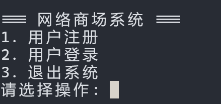
  注册时要求提供联系方式（后续会增加验证环节），且需要重复输入密码，防止误输：
  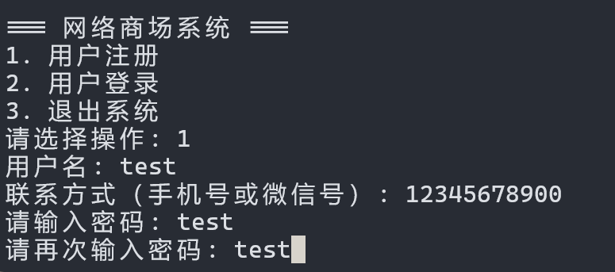
- **主页面**
  主页面提供多种选择：
  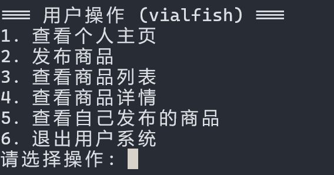
  **输入1**进入个人主页，可以修改个人信息：
  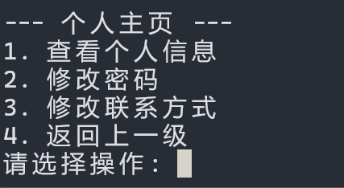
  **输入2**进行发布商品：
  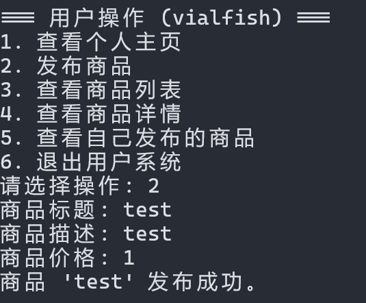
  **输入3**进行商品查询，可以输入部分关键词搜索，并结合**输入4**查看商品具体信息：
  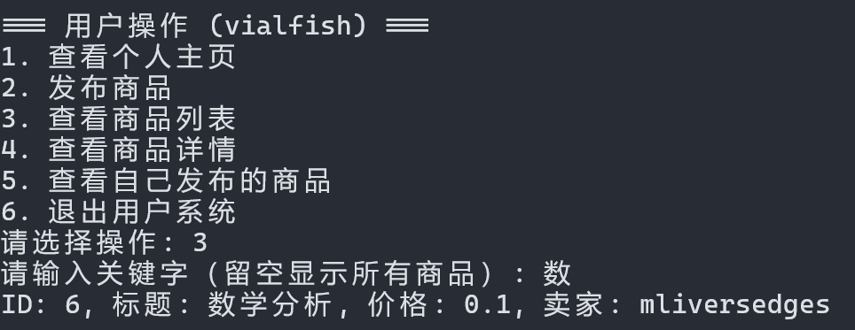
  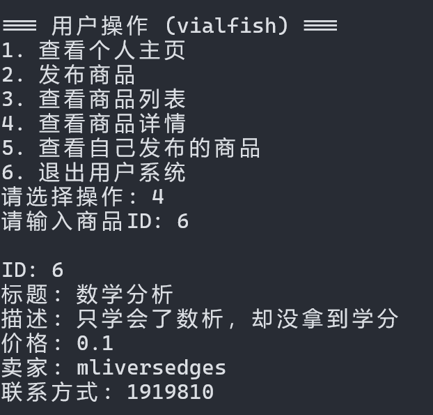
  **输入5**来查看自己发布的商品，并决定进一步修改或删除：
  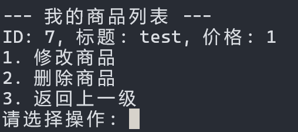
- **管理员系统**
  运行```python admin_main.py```进入管理员软件，以下是管理员登入界面：
  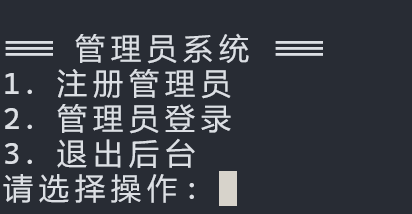
  登入后进入管理员面板：
  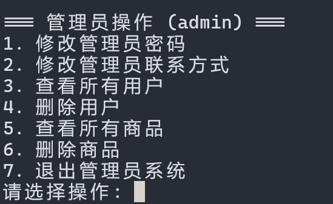
  下面主要展示查看用户和查看商品的界面：
  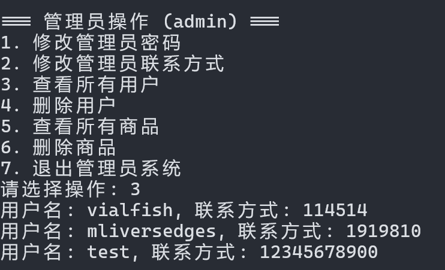
  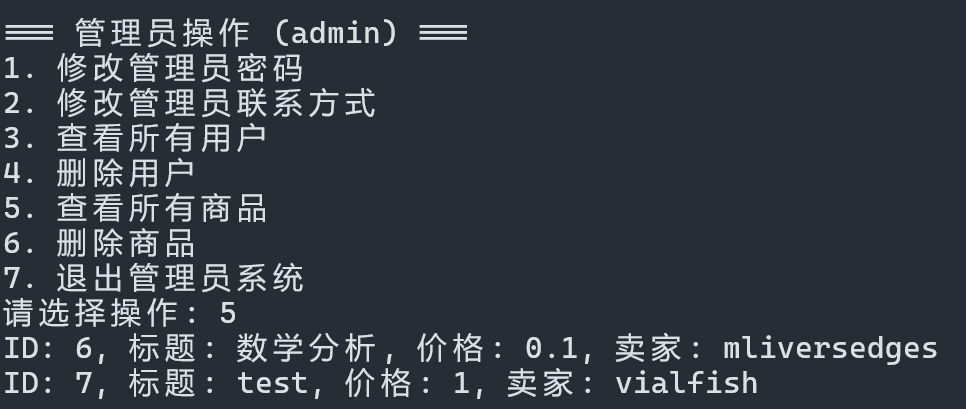